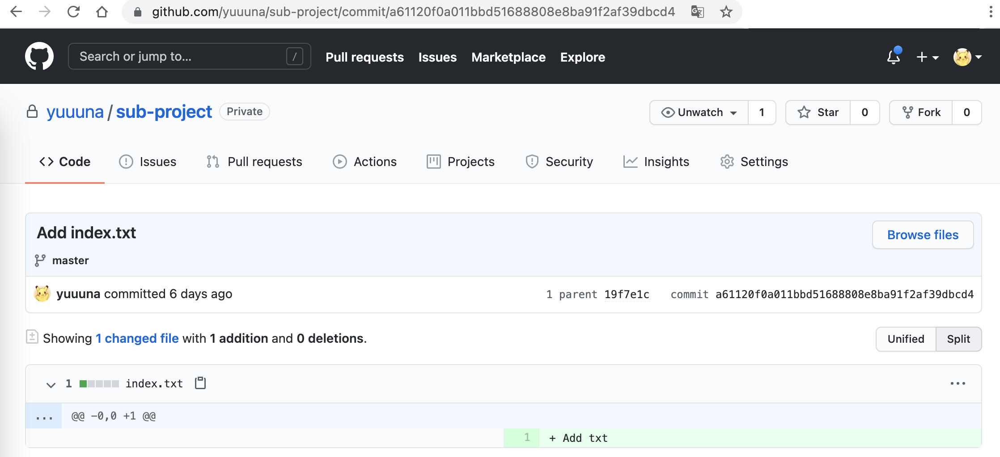

## 簡介

此篇文章主要使用 Command 的方式來操作，會先介紹一下會使用到的各個 Command 使用方法與功用，再介紹三種可以跨 Repository 取得 Commit 或 Merge Request (or Pull Request) 的方式。

## Command 介紹

這邊預設對 Git 有一定的基礎 (clone、pull、push、log...)，故僅介紹此篇主要使用的相關 Command。

### remote

Remote 為管理遠端 Repository 的功能，並可對每個連結的 Repository 設定名稱。

在 `git clone` 之後，會有一個預設的名稱 `origin`，這是 git 給的預設名稱。  
可以使用 `git remote` 查看目前有設定的 remote。


$ git clone git@github.com:yuuuna/main-project.git
Cloning into 'main-project'...
remote: Enumerating objects: 3, done.
remote: Counting objects: 100% (3/3), done.
remote: Total 3 (delta 0), reused 0 (delta 0), pack-reused 0
Receiving objects: 100% (3/3), done.

$ cd main-project

$ git remote
origin


使用 `git remote -v` 可以查看名稱 + Repository Url。


$ git remote -v
origin	git@github.com:yuuuna/main-project.git (fetch)
origin	git@github.com:yuuuna/main-project.git (push)


使用 `git remote add <名稱> <git repo url>` 新增連結的遠端 Repository。


$ git remote add sub git@github.com:yuuuna/sub-project.git


可以檢查一下剛剛新增的 remote，確認關聯成功！


$ git remote
origin
sub

$ git remote -v
origin	git@github.com:yuuuna/main-project.git (fetch)
origin	git@github.com:yuuuna/main-project.git (push)
sub	git@github.com:yuuuna/sub-project.git (fetch)
sub	git@github.com:yuuuna/sub-project.git (push)


目前設定了一個 `sub` 的遠端，但是可以發現目前沒有抓取此 Repo 的任何資訊，使用 `git log` 可觀察到目前還不認識 sub 裡面 master 這個分支。


$ git log sub/master
fatal: ambiguous argument 'sub/master': unknown revision or path not in the working tree.
Use '--' to separate paths from revisions, like this:
'git <command> [<revision>...] -- [<file>...]'


那接下來進入下個章節 `fetch` 學習抓取 `sub` 這個遠端的資訊。

### fetch

Fetch 可以抓取遠端資訊，把目前還沒載下來的資訊都抓下來。

現在我們把上一個指令中新增的 `sub` Repository 下載下來。


$ git fetch sub
remote: Enumerating objects: 6, done.
remote: Counting objects: 100% (6/6), done.
remote: Compressing objects: 100% (3/3), done.
remote: Total 6 (delta 0), reused 3 (delta 0), pack-reused 0
Unpacking objects: 100% (6/6), 832 bytes | 166.00 KiB/s, done.
From github.com:yuuuna/sub-project
 * [new branch]      master     -> sub/master


可以驗證一下，現在下載完成了，再試一下 `git log`，可以查看到 sub 的 master 分支 commit 內容囉！


$ git log sub/master

commit 19f7e1c17d4635733c96e1d512a3e5da2cbf2161 (sub/master)
Author: Yuuna <k9532121@gmail.com>
Date:   Sun May 30 15:21:11 2021 +0800

    Initial commit
(END)


### cherry pick

cherry-pick 的功能是「撿分支」，假如你目前的分支只想要其他分支的某幾個 Commit，那就很適合使用 cherry-pick 這個功能。

使用方法為：`git cherry-pick <commit SHA>`

目前專案分支如下，有兩條分支 `master`、`create-menu`。


那現在想要將 `create-menu` 的 `91ccde`(Create menu txt.) 紀錄放到 `master` 分支上，  
但不希望 `056791`(Update menu txt.) 也併到 `master` 上，  
那這個情境就很適合使用 cherry-pick 這個方法。

僅要將目前的分支先切到 `master`，然後使用 cherry-pick 想要的紀錄(`91ccde`)，即可完成囉！


$ git cherry-pick 91ccde
[master 6550d7d] Create menu txt.
 Date: Sun May 30 17:03:46 2021 +0800
 1 file changed, 2 insertions(+)
 create mode 100644 menu.txt


再觀察一下線圖，可以看到 Commit 紀錄也存在於 `master` 的分支上囉～


PS. 若是只想要這個 Commit 的修改紀錄，但是不要有 Commit 的送出紀錄，可以加上 `--no-commit`，那僅會將調整紀錄放至暫存區。


$ git cherry-pick 91ccde --no-commit

$ git status
On branch master
Your branch is behind 'origin/master' by 1 commit, and can be fast-forwarded.
  (use "git pull" to update your local branch)

Changes to be committed:
  (use "git restore --staged <file>..." to unstage)
	new file:   menu.txt


### diff

Diff 為比對檔案的修改紀錄，可以比對當前修改的有哪些、或是哪些 commit 區間的修改紀錄，接下來介紹幾個比較常用的方法。

1. `git diff`：比對當前的修改紀錄，此比對是在執行 `git add` 之前的檔案。
2. `git diff --cached`：這個比對的時機點是 `git add` 之後，`git commit` 之前，適用於執行 commit 之前做的檢查！
3. `git diff <commit SHA>`：這個會比對填入的 commit SHA ~ 當前工作目錄區間的修改紀錄。若想要看上一個 Commit 的紀錄，可以使用 `git diff HEAD^`。
4. `git diff <start commit SHA> <finish commit SHA>`：這個就是比對兩個 commit 區間的修改紀錄囉。

簡單對一個檔案進行了調整，使用 `git diff` 呈現如下：


diff --git a/index.txt b/index.txt
index 102db4a..853827d 100644
--- a/index.txt
+++ b/index.txt
@@ -1 +1,3 @@
 Add txt
+
+Update txt
(END)


這個應該蠻好懂的，大部分可能會使用 IDE 來幫助我們去看修改紀錄，不過這個指令搭配 `apply` 其實就可以幫助我們匯入此次調整紀錄！

### apply

Apply 對一般使用 git 的人應該會比較陌生，Apply 的功能簡單講的話，就是同意一個 Diff 檔案的修改紀錄，而這個 Diff 檔案就是由 `git diff` 來產生。

那同意一個 Diff 檔案是什麼意思？  
他會將這個 Diff 檔案的修改紀錄，都放到暫存區裡面。

說這麼多可能還是很模糊，直接來看實作比較好暸解！  
這是 Diff 檔案的樣子，其實就是 `git diff` 後的結果XD

diff --git a/index.txt b/index.txt
new file mode 100644
index 0000000..102db4a
--- /dev/null
+++ b/index.txt
@@ -0,0 +1 @@
+Add txt


那要把這個 Diff 放到暫存區，只要執行 `git apply <diff file>` 即可。


# diff 的檔案名稱為 add.diff
$ git apply add.diff

# 完成 apply 了，使用 status 檢查一下，確認已經進入暫存區了
$ git status
On branch master
Your branch is up to date with 'origin/master'.

Untracked files:
  (use "git add <file>..." to include in what will be committed)
	index.txt

nothing added to commit but untracked files present (use "git add" to track)


### format patch

在 GitHub 或是 GitLab 上，其實都可以直接產出 format-patch 此功能產出後的檔案，  
這個檔案內容是使用 email 的格式，範例如下：


From a61120f0a011bbd51688808e8ba91f2af39dbcd4 Mon Sep 17 00:00:00 2001
From: Yuuna <k9532121@gmail.com>
Date: Sun, 30 May 2021 17:02:01 +0800
Subject: [PATCH] Add index.txt

---
 index.txt | 1 +
 1 file changed, 1 insertion(+)
 create mode 100644 index.txt

diff --git a/index.txt b/index.txt
new file mode 100644
index 0000000..102db4a
--- /dev/null
+++ b/index.txt
@@ -0,0 +1 @@
+Add txt
--


這個方法翻譯成指令：
`git format-patch --stdout <start commit SHA> <finish commit SHA> > update.patch`

那這邊僅介紹使用 GitHub 與 GitLab 產出的方法，  
這兩個網站使用的方法是相同的，以下將以 GitHub 為範例，  
那他支援 Commit 或是 Pull Request (Merge Request) 的使用。

假設目前我有一個 Commit 如下畫面：

這個 Commit 的網址是 `https://github.com/yuuuna/sub-project/commit/a61120f0a011bbd51688808e8ba91f2af39dbcd4`，  
那要產出 format-patch 的話，只要在網址最後面增加 `.patch` 就可以囉！

Pull Request (Merge Request) 的方法相同，只要在 Pull Request 的頁面網址後面增加 `.patch`，都會是 email 格式的 Patch 檔案。

那這個檔案可以搭配 `am` 指令，可以更加方便的匯入修改紀錄。

### am

am 的功能為同意一個 Email 格式的 Patch，把這一個 Patch 的 Commit 修改紀錄，放進需要調整的 Repository 裡面，  
而這個功能是搭配 `format patch` 來進行使用。

am 的指令為：
`git am -3 < <patch file>`

那假設目前有一個 Patch 檔案，名稱為 `AddIndex.patch`


# 進行匯入此 Patch 至當前專案
$ git am -3 < AddIndex.patch
Applying: Add index.txt

# 同意成功，使用 log 確認有 commit 紀錄
$ git log -1
commit df73650b075149333a2e5b99572cbaa655fcda78 (HEAD -> master)
Author: Yuuna <k9532121@gmail.com>
Date:   Sun May 30 17:02:01 2021 +0800

    Add index.txt
(END)


這樣就把 `AddIndex.patch` 的修改紀錄放至當前的 Repository 裡面囉！

## 實作：取得跨 Repository 取得紀錄

這邊將運用上面 Command 的介紹，組合出三種不同的方法，並可依照不同的情境來選擇方法。

### 方法一：remote + cherry pick

這個方法最好懂，也最適合新手，方法就是去撿想要的 Commit 紀錄過來。

流程如下：
1. 使用 `git remote` 遠端想要的 Repository
2. 使用 `git fetch` 剛剛設定的 Remote
3. 使用 `git cherry-pick` 把想要的分支撿過來，就完成囉！

那現在以案例來實作，目前有兩專案 `main-project`、`sub-project`，而 commit 紀錄如下圖：
 

目前想要在 `main-project` 的 master 分支新增 `sub-project` 的 `a61120` Commit 紀錄，  
操作如下：


# 1. Remote 需要的 Repository
$ git clone git@github.com:yuuuna/main-project.git

# 2. Fetch 剛剛 Remote 的遠端資訊下來
$ git fetch sub

# [驗證] 可以看想要的 commit SHA
$ git log sub/master

# 3. cherry-pick 需要的分支過來
$ git cherry-pick a61120f0a011bbd51688808e8ba91f2af39dbcd4

# 推送遠端，完成！
$ git push


觀察 git graph，有成功將 Commit 紀錄新增在 `main-project` 的 `master` 中了。



### 方法二：diff + apply

若你是熟悉 Git 的使用，那這個方法你只要暸解了 `Diff` 與 `Apply` 的功能，可以知道其實也不會太難，輕鬆兩個指令就可以完成，也比起 `cherry-pick` 的方法精簡一些。

流程如下：
1. 使用 `git diff <commit 1> <commit 2> > update.diff` 將調整紀錄輸出成一個檔案，這裡名稱為 `update.diff`
2. 到我要匯入的專案裡面，使用 `git apply update.diff`，就會把修改紀錄會進去暫存區了！

那現在以案例來實作，目前有兩專案 `main-project`、`sub-project`，而 commit 紀錄如下圖：
 

目前想要在 `main-project` 的 master 分支新增 `sub-project` 的 `a61120` Commit 紀錄，  
操作如下：

1. 先到 `sub-project` 專案目錄下：

# 產生 Diff 檔案，需要的是 19f7e1 與 a61120 區間的修改紀錄
$ git diff 19f7e1 a61120 > update.diff


2. 把 `update.diff` 放至 `main-project` 裡面，方便下個步驟直接使用

3. 切到 `main-project` 專案目錄下：

# 使用 apply 將 update.diff 匯入至暫存區
$ git apply update.diff


這樣就完成囉！  
只是這個方法是將調整紀錄放進暫存區，所以後續還要自己進行 `Commit` 的動作，才能 `Push` 呦  
那可以看接下來第三個方法，也是我最推薦最方便快速的！

### 方法三：format patch + am

這個方法是我最推薦的方法，只要暸解一下每個步驟的功能，可以簡單上手。

流程如下：
1. 在 GitHub (or GitLab) 上到你想要產出修改紀錄的 Commit 或 Pull Request (or Merge Request) 頁面。
2. 直接在網址最後方新增 `.patch`，並下載此頁面的內容為檔案，這裡名稱為 `update.patch`。
3. 將檔案放至本地要匯入的 Repository 中。(方便等一下指令直接使用此檔案)
4. 使用 `git am -3 < update.patch`，這樣就把檔案內的每一個 Commit 的修改紀錄都進去囉！

那現在以案例來實作，目前有兩專案 `main-project`、`sub-project`，而 commit 紀錄如下圖：
 

目前想要在 `main-project` 的 master 分支新增 `sub-project` 的 `a61120` Commit 紀錄，  
操作如下：

1. 到 GitHub `a61120` 這一個 Commit 的頁面上。

2. 直接在網址最後面新增 `.patch`，然後下載這個頁面為檔案。

3. 將檔案放進 `main-project` 裡面。

4. 指令目錄切換到 `main-project` 專案目錄下：

# 進行匯入此 Patch 至當前專案
$ git am -3 < update.patch
Applying: Add index.txt


這樣就完成囉！

假若你同時維護多個相同底層的系統，  
此時要修改底層的東西時，又要同步到各個相同底層的系統，  
那這個方法會很方便去實現同步這件事，  
將修改紀錄產生一個 Patch 檔案，然後再專案底下使用 am 匯入進去，  
最後在 Push 至遠端，完成！

